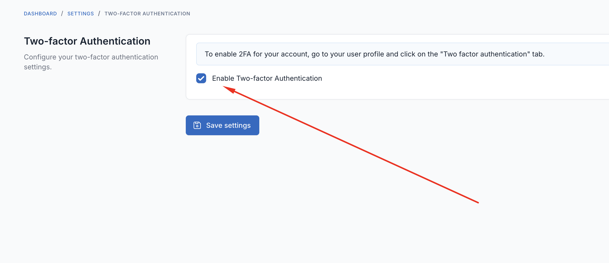
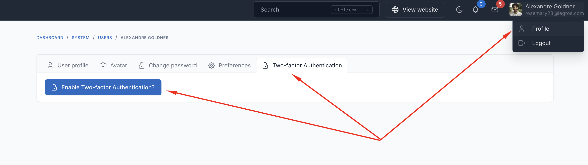
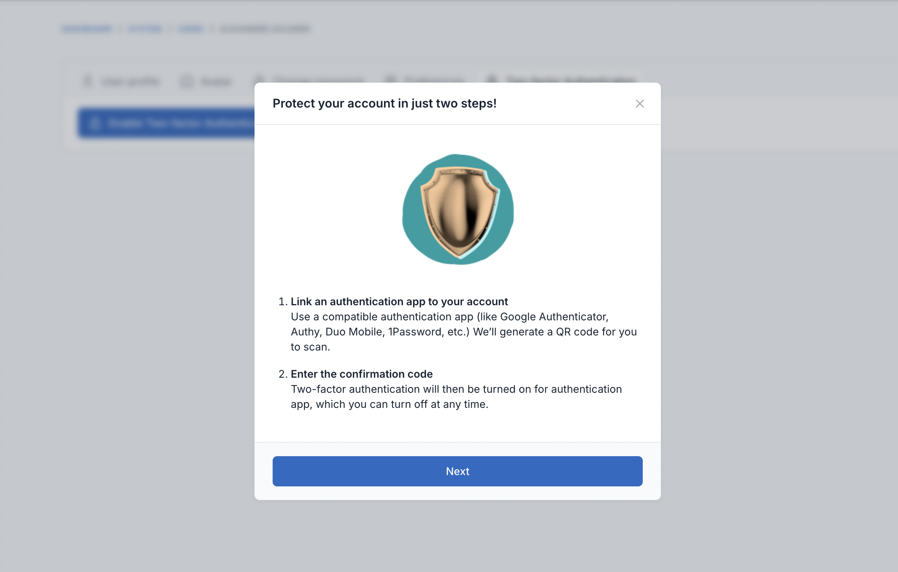
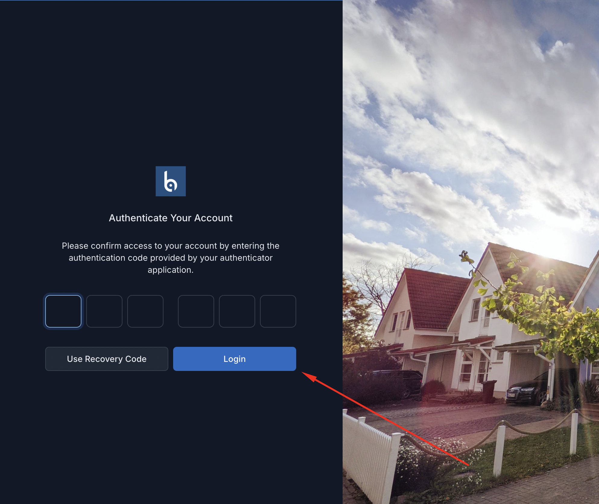

# Two-factor Authentication for Botble CMS

Add an extra layer of security to your account with two-factor authentication (2FA).

## What is 2FA?

Two-factor authentication requires two things to log in:
1. Your password (something you know)
2. A 6-digit code from your phone (something you have)

This makes your account much more secure.

## Getting Started

### Step 1: Enable 2FA for your site
Go to **Settings** → find **Two-factor Authentication** → turn it on

### Step 2: Set up 2FA for your account
1. Go to **My Profile** → click **Two-factor Authentication** tab

2. Click **Enable Two-factor Authentication**
3. Install an authenticator app on your phone:
   - Google Authenticator
   - Microsoft Authenticator
   - 1Password
   - Authy
4. Scan the QR code with your app

5. Enter the 6-digit code from your app
6. Save your backup codes in a safe place

## How to Log In

After entering your password, you'll see a screen asking for a 6-digit code:
- Open your authenticator app
- Enter the code shown in the app
- For 1Password users: The code will fill automatically

## Tips

- **Lost your phone?** Use one of your backup codes to log in
- **Can't scan the QR code?** Click "Can't scan?" and enter the code manually
- **Save your backup codes** somewhere safe - you'll need them if you lose your phone

## Contributing

Please see [CONTRIBUTING](CONTRIBUTING.md) for details.

## Security

If you discover any security-related issues, please email contact@archielite.com instead of using the issue tracker.

## Credits

-   [Archi Elite](https://github.com/archielite)
-   [All Contributors](../../contributors)

## License

The MIT License (MIT). Please see [License File](LICENSE) for more information.
