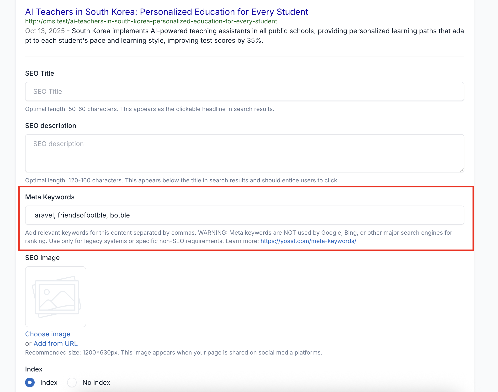
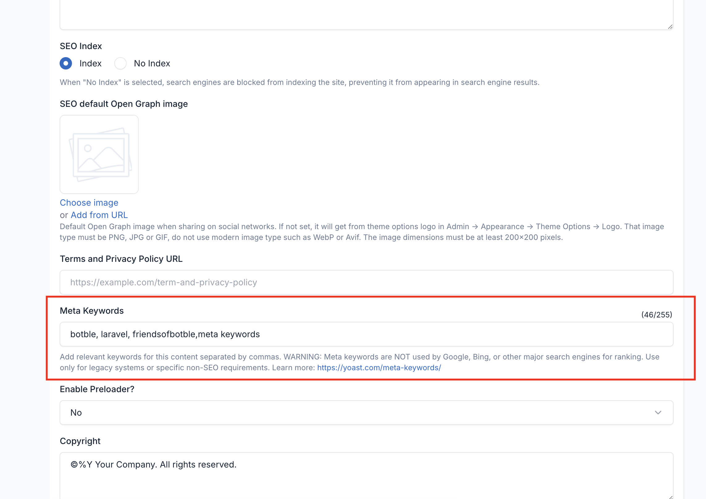
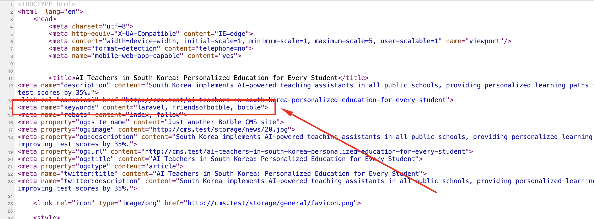

# FOB SEO Meta Keywords

A plugin for Botble CMS that adds meta keywords field support to the SEO Helper package, enabling administrators to add meta keywords to individual content and configure global keywords, though **not recommended for modern SEO purposes**.

## Requirements

- Botble core 7.2.6 or higher.
- PHP 8.2 or higher.

## Installation

### Install via Admin Panel

Go to the **Admin Panel** and click on the **Plugins** tab. Click on the "Add new" button, find the **FOB SEO Meta Keywords** plugin and click on the "Install" button.

### Install manually

1. Download the plugin from the [Botble Marketplace](https://marketplace.botble.com/products/friendsofbotble/fob-seo-meta-keywords).
2. Extract the downloaded file and upload the extracted folder to the `platform/plugins` directory.
3. Go to **Admin** > **Plugins** and click on the **Activate** button.

## Features

- **SEO Meta Box Integration**: Add keywords field to posts, pages, and other SEO-enabled content
- **Theme Options Integration**: Configure global fallback keywords for entire site
- **Smart Priority System**: Page-specific keywords automatically override global keywords
- **Multi-language Support**: Fully translated into 42 languages
- **Warning System**: Clear, prominent warnings about meta keywords ineffectiveness
- **No Database Migration**: Uses existing meta_boxes and settings tables
- **Clean Integration**: Seamlessly integrates with existing SEO Helper package
- **Auto-removal**: Removes default "no meta keywords" warning message

## ⚠️ Important Warning About Meta Keywords

**Meta keywords are NOT recommended for SEO purposes.**

According to [Yoast's research](https://yoast.com/meta-keywords/), major search engines including Google, Bing, and Yahoo have officially stated that they **do not use meta keywords** for ranking purposes:

- **Google**: Announced in 2009 that meta keywords are completely ignored
- **Bing**: Does not use meta keywords for ranking (may use them to detect spam)
- **Yahoo**: Stopped using meta keywords for ranking years ago

### Why Meta Keywords Don't Help SEO:

1. **Search engines ignore them** - They have no impact on your rankings
2. **Give away your strategy** - Competitors can see which keywords you're targeting
3. **Potential spam signal** - Overuse may trigger spam filters
4. **Waste of time** - Better to focus on quality content and proper on-page SEO

### When Should You Use This Plugin?

Only use this plugin if you have **specific non-SEO requirements**, such as:

- Legacy system compatibility
- Internal site search functionality
- Third-party integrations that require meta keywords
- Client-specific requirements

**For SEO purposes, focus on:**
- Quality, relevant content
- Proper heading structure (H1, H2, etc.)
- Meta titles and descriptions
- Image alt text
- Internal linking

**Learn more:** [Why meta keywords are a thing of the past - Yoast](https://yoast.com/meta-keywords/)

## Usage

### For Store Administrators

#### Configure Global Keywords (Optional)

1. Navigate to **Appearance** > **Theme Options**
2. Find the "Meta Keywords" field in the General section
3. Enter global keywords separated by commas
4. Click Save to apply site-wide fallback keywords

#### Configure Page-Specific Keywords

1. Edit any content (Post, Page, etc.)
2. Scroll to the **SEO** meta box
3. Find the "Meta Keywords" field
4. Enter keywords separated by commas
5. Save the content

### For Site Visitors

The meta keywords are automatically rendered in the HTML `<head>` section:

```html
<meta name="keywords" content="cms, laravel, botble, seo">
```

### Priority System

- If a page has specific keywords → those are used
- If no specific keywords → global keywords from theme options are used
- If neither → no keywords meta tag is rendered

## Configuration Options

### SEO Meta Box (Per-Content)

- **Meta Keywords**: Comma-separated keywords for specific content
- Includes warning about SEO ineffectiveness
- Overrides global keywords when set

### Theme Options (Global)

Access at **Appearance** > **Theme Options** > **General**:

- **Meta Keywords**: Comma-separated global keywords
- Used as fallback for all pages without specific keywords
- Includes warning about SEO ineffectiveness

## Screenshots

### Meta Keywords in SEO Meta Box

*Meta keywords field integrated into the SEO meta box for individual content (posts, pages, etc.)*

### Global Meta Keywords in Theme Options

*Global meta keywords configuration in Appearance > Theme Options > General*

### Meta Keywords in HTML Source

*Meta keywords tag automatically rendered in the HTML `<head>` section*

## Contributing

Please see [CONTRIBUTING](CONTRIBUTING.md) for details.

## Bug Reports

If you discover a bug in this plugin, please [create an issue](https://github.com/FriendsOfBotble/fob-seo-meta-keywords/issues).

## Security

If you discover any security related issues, please email friendsofbotble@gmail.com instead of using the issue tracker.

## Credits

- [Friends Of Botble](https://github.com/FriendsOfBotble)
- [All Contributors](../../contributors)

## License

The MIT License (MIT). Please see [License File](LICENSE) for more information.
